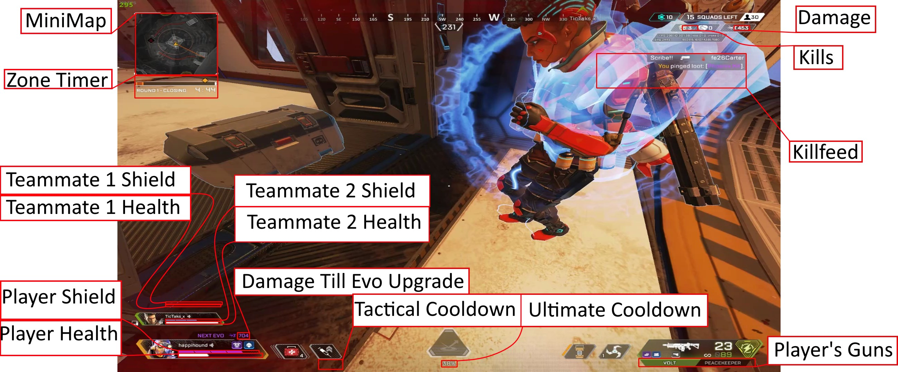

# Apex Legends Analysis Tool README

Welcome to the comprehensive guide for the 'Apex Legends Analysis Tool' project. This suite of modules provides a detailed analysis of various gameplay metrics in the popular battle royale game, Apex Legends. By harnessing advanced image processing techniques, optical character recognition, and meticulous data management, this tool offers unparalleled insights into game dynamics and player performance. Developed in collaboration with topic experts in the apex analysis field, this project is a fully featured suite of tools.

## Table of Contents

- [Apex Legends Analysis Tool README](#apex-legends-analysis-tool-readme)
  - [Table of Contents](#table-of-contents)
    - [Introduction ](#introduction-)
    - [Video Decomposition Tool ](#video-decomposition-tool-)
    - [Damage Tracker ](#damage-tracker-)
    - [Coordinator ](#coordinator-)
    - [Evolution Shield Tracker ](#evolution-shield-tracker-)
    - [Game Map Image Manager ](#game-map-image-manager-)
    - [Mini Map Plotter ](#mini-map-plotter-)
    - [Player Gun Tracker ](#player-gun-tracker-)
    - [Player Health Tracker ](#player-health-tracker-)
    - [Player Kill Tracker ](#player-kill-tracker-)
    - [Player Shield Tracker ](#player-shield-tracker-)
    - [Player Tactical Ability Tracker ](#player-tactical-ability-tracker-)
    - [Player Ultimate Ability Tracker ](#player-ultimate-ability-tracker-)
    - [User Map Image Processor ](#user-map-image-processor-)
    - [Zone Timer Tracker ](#zone-timer-tracker-)
    - [Apex Legends Utility Class ](#apex-legends-utility-class-)
  - [Conclusion](#conclusion)

---

### Introduction 

The 'Apex Legends Analysis Tool' is an intricate ensemble of modules meticulously crafted to delve deep into the nuances of Apex Legends gameplay. Whether you're a casual gamer, a competitive player, or a data enthusiast, this tool offers a treasure trove of insights, charting player performance, game mechanics, and much more. Navigate through the modules using the table of contents above to explore the full breadth of functionalities on offer.

---

### Video Decomposition Tool 

**File**: videoDecompositionTool.py

**Overview**: The `videoDecompositionTool.py` module stands out as a robust tool dedicated to dissecting videos into specific image frames. By leveraging the ffmpeg library, this tool deconstructs a video, isolating frames that spotlight various game elements, and archives these frames as PNG images in designated directories.

**Key Features**:

- **Video File Format Detection**: Detects the video's file format (e.g., .mkv) to ensure compatibility.
- **Dynamic Output Paths Setup**: Configures output paths for different video frame types, such as killFeed, playerEvo, playerDamage, and miniMap, ensuring organized storage.
- **Efficient Frame Extraction**: Utilizes the ffmpeg library, capitalizing on keyframes and GPU acceleration, to crop and extract high-quality frames from the video.

**Decomposition Key**:

---

### Damage Tracker 

**File**: damageTracker.py

**Overview**: At the heart of the project lies the `damageTracker.py` file, an adept tool fashioned to chronicle the damage a player inflicts in a game. With the power of Optical Recognition (OCR), it extracts and logs damage values from in-game images. A series of filters ensure the accuracy of these values, discarding any anomalies that could skew the analysis. The outcomes are meticulously logged, pairing frame numbers with cumulative damage, thereby painting a vivid picture of the player's combat prowess.

**Key Features**:

- **OCR Integration**: Harnesses Optical Character Recognition to diligently extract damage values from in-game images.
- **Dynamic Filtering**: Employs dynamic filters to ensure the accuracy and reliability of the extracted damage values.
- **Data Storage**: Archives the extracted damage values, aligning them with their corresponding frame numbers for a chronological analysis of the player's performance.

**Visual Element**:
- **[Space for Damage Tracking Samples]**: An array of in-game images showcasing the damage tracking process, from extraction to logging.

---

### Coordinator 

**File**: coordinator.py

**Overview**: The `coordinator.py` script emerges as the central nervous system of this project, orchestrating the execution of various game data extraction and visualization modules. With a flexible design, users can either command a full-fledged analysis or cherry-pick specific methods, ensuring a tailored experience.

**Key Features**:

- **Flexible Execution**: Offers users the latitude to either conduct a comprehensive analysis or focus on specific methods of interest.
- **Diverse Trackers**: Encompasses a plethora of trackers, spanning player stats, game environment, and other gameplay nuances.
- **Data Consolidation and Visualization**: As the final act, the coordinator seamlessly amalgamates the extracted data from various modules, laying the groundwork for insightful visualizations.

**Visual Element**:
- **[Space for Coordinator Functionality Illustrations]**: Diagrams or flowcharts underscoring the coordination and flow of data extraction and processing.

---

### Evolution Shield Tracker 

**File**: evoTracker.py

**Overview**: The `evoTracker.py` module is intricately woven to chronicle the evolution of a player's shield during gameplay. As players inflict damage, their shields evolve, and this tracker captures that progression, offering insights into the player's defensive dynamics.

**Key Features**:

- **Image-Based Shield Tracking**: Combs through game images, identifying and quantifying the player's evolving shield.
- **OCR Integration**: Leverages Optical Character Recognition to accurately capture shield values.
- **Data Validation and Storage**: Employs rigorous validation checks, ensuring only genuine shield values make the cut. The outcomes are systematically archived for future analysis.

**Visual Element**:
- **[Space for Evolution Shield Tracking Samples]**: A curated selection of images depicting the shield evolution tracking, reflecting the player's defensive journey.

---

### Game Map Image Manager 

**File**: gameMapImage.py

**Overview**: The `gameMapImage.py` module establishes a structured approach to manage and represent in-game map images. Equipped with functionalities to retrieve, compare, and manipulate images, this module serves as a robust foundation for other map-related processes.

**Key Features**:

- **Aspect Ratio Management**: The module seamlessly handles image ratios, offering methods to both retrieve and parse aspect ratios.
- **Image Retrieval and Copy**: Facilitates easy retrieval of stored images and allows for the creation of identical copies for further processing.
- **Image Comparison**: Implements an equality check method to compare two game map images based on image content and aspect ratio.

**Visual Element**:
- **[Space for Game Map Image]**: A snapshot of the game map image managed by this module, showcasing its quality and clarity.

---

### Mini Map Plotter 

**File**: miniMapPlotter.py

**Overview**: The `miniMapPlotter.py` module is a masterclass in image matching, pinpointing the position of a mini-map on a comprehensive game map. By contrasting feature points and calculating perspective transformation, the module delivers precise coordinates of the mini-map.

**Key Features**:

- **Map Setup for Matching**: Prepares the game map by loading, resizing, and detecting features to ensure optimal matching.
- **Dynamic Color Computation**: Generates a color gradient based on a fraction between two defined colors, enhancing visualization.
- **Image Validation**: Post matching, the module verifies the matched area using contour areas and a rolling average, ensuring authenticity.
- **Homography Computation**: Through the computation of perspective transformation, the module extracts the mini-map's exact position on the game map.

**Visual Element**:
- **[Space for Matched Mini Map on Game Map]**: A visual representation of the mini-map matched against the game map, highlighting its precise location.

---

### Player Gun Tracker 

**File**: playerGunTracker.py

**Overview**: The `playerGunTracker.py` module stands out as a specialized tool to track players' firearms throughout a game. By leveraging Optical Character Recognition (OCR), the module meticulously identifies guns and associates them with specific frame numbers, compiling the results into a systematic CSV.

**Key Features**:

- **OCR-based Gun Detection**: Capitalizes on OCR to detect gun names from in-game images, providing a foundation for tracking.
- **String Similarity Measurement**: By measuring the similarity between two strings, the module refines gun detection, ensuring accuracy.
- **Filtering Mechanism**: Implements a filtering process on detected gun names, emphasizing neighboring values and frequency for enhanced precision.
- **Multiprocessing for Efficiency**: Adopts parallelism to expedite the gun tracking process, ensuring swift and efficient results.

**Visual Element**:
- **[Space for Gun Detection Samples]**: A montage of in-game screenshots showcasing the gun detection process, highlighting the accuracy and precision of the OCR-based system.

---

### Player Health Tracker 

**File**: playerHealthTracker.py

**Overview**: Armed with image processing techniques, the `playerHealthTracker.py` module is crafted to track a player's health throughout the game. By analyzing visual cues such as the health bar's width, this script captures a player's health as a percentage, providing invaluable insights into their survivability.

**Key Features**:

- **Image-based Health Detection**: Uses contour detection to identify the player's health bar in the game, representing the health as a percentage based on the width.
- **Downed Player Detection**: Incorporates a feature to detect if a player is downed by examining specific color thresholds in the game frame.
- **Data Smoothing**: Employs the `statsmodels` library to smooth the extracted health data, providing a more consistent data set.
- **Result Storage**: Methodically saves the results, including frame numbers and health percentages, for future analysis.

**Visual Element**:
- **[Space for Health Tracking Samples]**: A sequence of in-game images highlighting the process of health tracking, showcasing the detection of health bars and the downed state.

---

### Player Kill Tracker 

**File**: playerKillTracker.py

**Overview**: The `playerKillTracker.py` module is a precision tool, leveraging OCR to track a player's kills during gameplay. Through dynamic image cropping and meticulous text extraction, the script captures the kill count, offering a tangible metric of a player's offensive prowess.

**Key Features**:

- **OCR-based Kill Detection**: Extracts the number of kills from game images using Optical Character Recognition.
- **Dynamic Image Cropping**: Features a dynamic cropping method to isolate the section of the image containing the kill count, ensuring accurate OCR readings.
- **Data Filtering**: Incorporates a mechanism to filter extracted kill counts, refining the data for maximum accuracy.

**Visual Element**:
- **[Space for Kill Detection Samples]**: A series of game snapshots detailing the kill detection process, emphasizing the OCR's accuracy in capturing kill counts.

---

### Player Shield Tracker 

**File**: playerShieldTracker.py

**Overview**: The `playerShieldTracker.py` module is engineered to meticulously track a player's shield in the game. Harnessing the power of image processing, the tracker parses game frames, identifies the shield, computes a numeric value for it, and archives the results.

**Key Features**:

- **Image-based Shield Detection**: Uses image processing techniques to identify and measure the player's shield in-game.
- **Shield Quantification**: Represents the shield as a numeric value based on the detected shield width.
- **Data Filtering and Saving**: Incorporates mechanisms to filter the extracted shield values and save them systematically for subsequent analysis.

**Visual Element**:
- **[Space for Shield Tracking Samples]**: A collection of in-game images elucidating the shield tracking process, showcasing the detection and quantification of shields.

---

### Player Tactical Ability Tracker 

**File**: playerTacTracker.py

**Overview**: The `playerTacTracker.py` script is a specialized module designed to trace a player's tactical abilities, likely in terms of cooldown times, throughout gameplay. By synergizing image processing and OCR, this tracker provides detailed insights into a player's tactical prowess and decision-making.

**Key Features**:

- **OCR-based Tactical Ability Tracking**: Extracts tactical ability details from game images using Optical Character Recognition.
- **Data Processing and Cleaning**: Processes the extracted text, filters out noise, and captures relevant tactical information.
- **Data Smoothing**: Utilizes LOWESS (Locally Weighted Scatterplot Smoothing) to ensure consistency in the extracted tactical data.
- **Result Visualization and Storage**: While visualization is currently commented out, the module provides mechanisms to save the tactical ability tracking results.

**Visual Element**:
- **[Space for Tactical Ability Tracking Samples]**: An assortment of game images detailing the tactical ability tracking, highlighting the extraction and quantification of abilities.

---

### Player Ultimate Ability Tracker 

**File**: playerUltTracker.py

**Overview**: The `playerUltTracker.py` module is proficiently constructed to track a player's ultimate abilities throughout the game, likely in terms of cooldown times. By fusing image processing and OCR, this tracker diligently scans game images, discerns timing details, and presents a numeric value for ultimate abilities, archiving these results for future scrutiny.

**Key Features**:

- **OCR-based Ultimate Ability Tracking**: Efficiently extracts ultimate ability details from game images.
- **Result Processing**: Processes the OCR results, purging noise and capturing only the pertinent ultimate ability information.
- **Data Refinement**: Uses filtering methods to polish the acquired data, ensuring precision and reliability.

**Visual Element**:
- **[Space for Ultimate Ability Tracking Samples]**: A compilation of in-game images illustrating the ultimate ability tracking process, underscoring the detection and quantification of abilities.

---

### User Map Image Processor 

**File**: userMapImage.py

**Overview**: The `userMapImage.py` script brings forth the `userMapImage` class, specially devised to process and finetune game map images. This class excels in cropping, feature extraction, and image manipulation, proving indispensable for any game map-related operations.

**Key Features**:

- **Image Cropping and Processing**: Crops game map images based on different aspect ratios and refines the visual details.
- **Game Zone Extraction**: Houses a specialized function to extract the game zone from the map, with special handling techniques for certain aspect ratios.
- **Target Detection**: Although the implementation details are truncated, it suggests the ability to detect targets on the game map.

**Visual Element**:
- **[Space for Processed User Map Image Samples]**: A display of processed game map images, emphasizing the cropping, feature extraction, and other transformations carried out by this class.

---

### Zone Timer Tracker 

**File**: ZoneTimerTracker.py

**Overview**: The `ZoneTimerTracker.py` script manifests the ZoneTimerTracker class, a dedicated tool to track the game's zone timer. Through adept image processing and OCR, this tool captures timing details, presenting a numeric value that likely represents the countdown until a game zone closes.

**Key Features**:

- **OCR-based Zone Timer Tracking**: Extracts zone timer details from game images with precision.
- **Result Processing**: Processes the OCR results, eliminating noise and capturing only the pertinent zone timer information.
- **Data Refinement**: Employs filtering methods to polish the acquired data, ensuring reliability and accuracy.

**Visual Element**:
- **[Space for Zone Timer Tracking Samples]**: A compilation of in-game images illustrating the zone timer tracking process, emphasizing the detection and quantification of timing details.

---

### Apex Legends Utility Class 

**File**: apexUtils.py

**Overview**: The `apexUtils.py` module unfurls the ApexUtils class, a foundational utility class that renders diverse functionalities to bolster the main tracking modules. From image processing to file operations, this versatile utility class streamlines various tasks integral to the project's objectives.

**Key Features**:

- **Lazy Loading**: Intelligently loads resources like the OCR reader and super-resolution model only when needed, optimizing memory usage.
- **OCR Integration**: Seamlessly integrates with easyocr to extract textual content from images.
- **File Operations**: Provides methods for file loading, CSV merging, reading, and saving, ensuring efficient data management.
- **Image Display and Processing**: Houses methods to display images and apply super-resolution, enhancing the visual clarity.
- **Text Wrapping**: Contains a text wrapping function to fit text within specified bounds, useful for annotations and image overlays.

**Visual Element**:
- **[Space for Utility Function Samples]**: A sequence of images or diagrams illustrating some of the utility functions in action, such as OCR extraction, super-resolution results, and file merging.

---

## Conclusion

The 'Apex Legends Analysis Tool' project offers a robust collection of modules designed for detailed game insights. Leveraging advanced image processing, optical character recognition, and structured data handling, the tool efficiently tracks and evaluates diverse game metrics, from player statistics to intricate map details. Every module is fine-tuned to capture specific game elements, providing a layered perspective on game dynamics. Whether you're looking to elevate your gaming strategies, delve into gameplay trends, or appreciate the intricate facets of Apex Legends, this toolkit stands ready to provide unparalleled analytical depth. Delve into its features and experience game analysis in a transformative way!

**Happy Analyzing!**